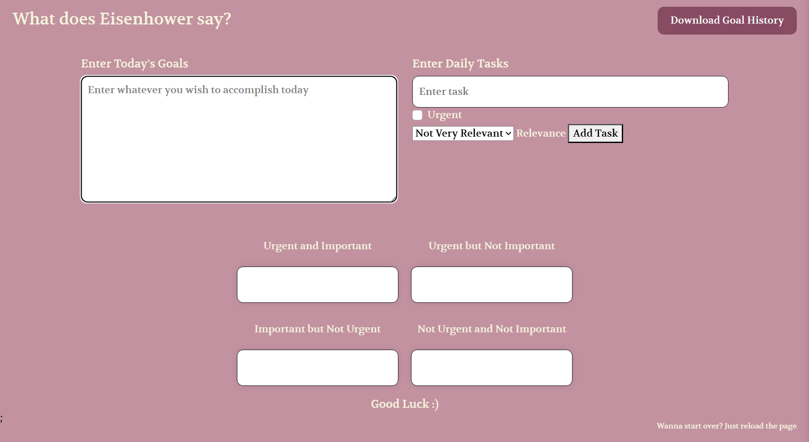

# Eisenhower-Matrix-Task-Manager
A lightweight web app to organize your daily tasks based on the Eisenhower Matrix — categorizing tasks by urgency and importance to help prioritize effectively.

## Features

- Input daily tasks and mark urgency and relevance.
- Tasks automatically sorted into four matrix quadrants:
  - Urgent and Important
  - Urgent but Not Important
  - Important but Not Urgent
  - Not Urgent and Not Important
- Enter and save daily goals.
- Download your goal history as a text file.
- Clean and elegant UI with a warm beige color theme and easy-to-read Georgia font.

## Technologies Used

- HTML5
- CSS3
- JavaScript (Vanilla)

## How to Use

1. Enter your daily goals in the text area.
2. Add tasks by typing them, selecting if they are urgent and relevant, and clicking "Add Task."
3. Tasks appear in their respective quadrants automatically.
4. Click "Download Goal History" to save your goals locally.
